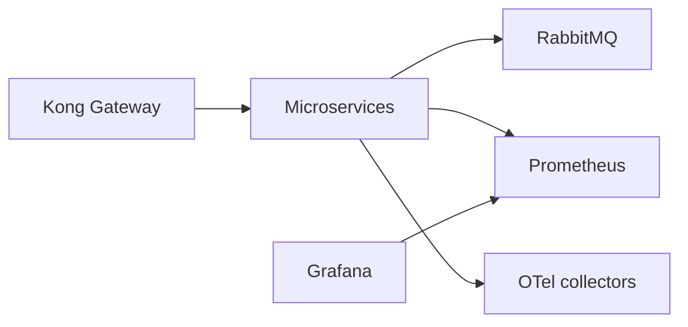

# Platform K8s

Shared Kubernetes platform repository for the Phase 3 and Phase 4 runtime.

## Responsibility

- Kong API Gateway manifests
- RabbitMQ topology manifests
- Prometheus, Grafana and OpenTelemetry collector manifests
- shared namespaces and base configuration
- local validation of rendered Kubernetes and RabbitMQ definitions
- no ownership of business data

## Technology

- Kubernetes manifests with Kustomize
- Kong DB-less configuration
- RabbitMQ
- Prometheus
- Grafana
- OpenTelemetry collectors
- GitHub Actions CI/CD

## Architecture



## External Dependencies

- Kubernetes cluster
- `kubectl`
- Kustomize via `kubectl kustomize`

## Validation Commands

```bash
npm ci
npm run validate
kubectl kustomize k8s
```

Validation covers:

- Kong route template
- Kubernetes manifest structure
- RabbitMQ definitions and bindings
- observability manifest integrity

## CI/CD

Workflow files:

- `.github/workflows/ci.yml`
- `.github/workflows/cd.yml`

CI runs:

- `npm ci`
- `npm run validate`
- `kubectl kustomize k8s`

CD is configured for:

- `homologation` -> GitHub Environment `homologation`
- `main` -> GitHub Environment `production`

CD applies only platform manifests from this repository. No microservice
manifest is owned here.

## Observability

This repository owns the observability stack selected by ADR 007:

- Prometheus
- Grafana
- OpenTelemetry collectors

Current baseline documentation:

- [platform foundation](docs/platform-foundation.md)
- [API gateway routes](docs/api-gateway-routes.md)
- [observability baseline](docs/observability-baseline.md)

The Prometheus service scrapes preserve:

- `namespace` from Kubernetes namespace metadata
- `service` from `app.kubernetes.io/name`
- `pod` from pod name

These labels support uptime and latency grouping without adding high-cardinality
business identifiers.

## Local Apply

```bash
kubectl apply -k k8s
```

That command is documented because the manifests are owned here. It was not
executed remotely in this workspace.

## Delivery Evidence

- repository URL: `PENDING`
- homologation URL: `PENDING`
- latest successful CI run: `PENDING`
- quality gate: `PENDING`
- coverage evidence: `PENDING (manifest repository without local coverage artifact)`
- branch protection: `PENDING VERIFICATION`

## External Evidence Status

- hosted cluster and ingress URLs: `PENDING`
- GitHub environments and branch protection: `PENDING VERIFICATION`
- no remote `kubectl apply` was executed from this workspace
